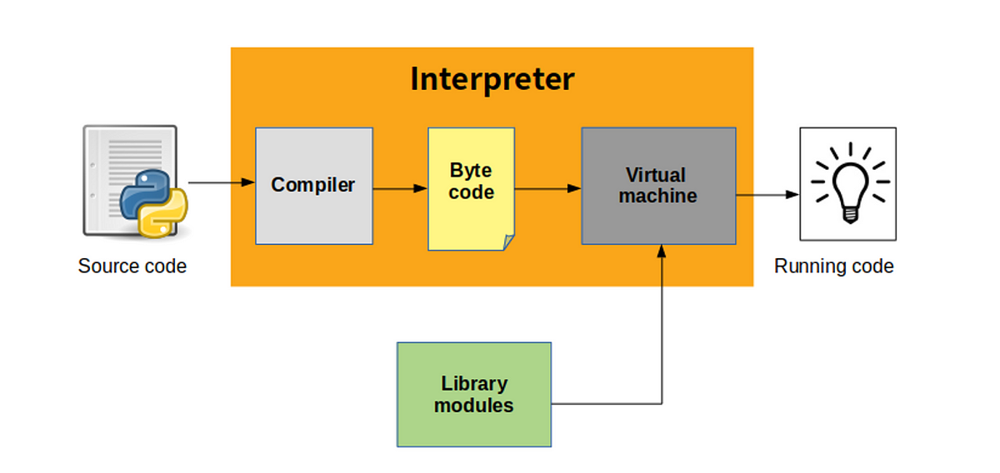

### Python's Internal Workings: Reference, Slice, etc.

Python is an interpreted, high-level programming language that offers a clean and readable syntax. The internal workings of Python involve several key aspects:

#### Compilation and Execution

When you run a Python script, the code is first compiled into **bytecode**, which is then interpreted by the Python Virtual Machine (PVM)[2][3].

#### Python Virtual Machine (PVM)

The PVM is responsible for reading and executing Python code. It converts the human-readable Python code into bytecode, a low-level representation of the code that the PVM can understand and execute[3].

#### Bytecode Compilation

Compilation into bytecode improves the execution speed by reducing the overhead of interpreting the code line by line. The compiled bytecode can be stored in `.pyc` files, which the interpreter uses for faster subsequent executions[3].

#### Dynamic Typing

Python is dynamically typed, allowing you to change the type of a variable during runtime without explicit declaration. The interpreter keeps track of the types and handles memory allocation accordingly[3].

#### Memory Management

Python manages memory through a private heap space for storing all objects and data structures. The memory manager takes care of allocating and deallocating memory as needed using a reference counting mechanism and a garbage collector[3].

#### Global Interpreter Lock (GIL)

The GIL is a critical concept in Python, especially for multithreaded programs. It prevents multiple native threads from executing Python bytecodes simultaneously, making Python threads less suitable for CPU-bound tasks but effective for I/O-bound tasks[3].

#### Import Mechanism

Python's import mechanism allows you to modularize your code by splitting it into multiple files (modules). The `import` statement brings modules into the current namespace, enabling you to use functions, classes, and variables defined in those modules[3].

#### Slicing

In Python, slicing refers to extracting a portion of a sequence such as strings, lists, tuples, and arrays based on their indices. For example, `mylist[start:stop:step]` creates a new list containing elements starting from `start`, ending before `stop`, and incrementing by `step`.

#### Indexing

Indexing retrieves individual items within sequences based on their positions. For instance, `mylist[index]` returns the element at the given index within the sequence. Negative indices refer to positions relative to the end of the sequence.

Understanding these fundamental principles helps you write more efficient and optimized code, as well as appreciate the design choices that have made Python a language loved by developers worldwide.

Citations:
[1] https://discuss.python.org/t/learning-more-about-internal-working-of-python-indepth/14170
[2] https://blog.sourcerer.io/python-internals-an-introduction-d14f9f70e583?gi=b33f812e7fc6
[3] https://www.linkedin.com/pulse/taking-deep-dive-inner-workings-python-farhan-ahmed
[4] https://python.plainenglish.io/how-does-python-work-7dc53da52065?gi=664f3c89182c
[5] https://youtube.com/watch?v=9Zf1OMX2qSs